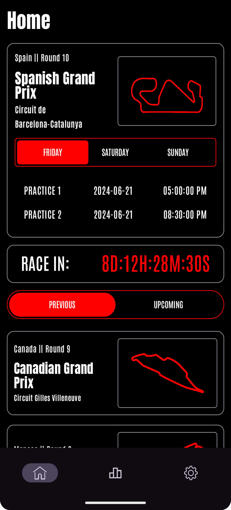
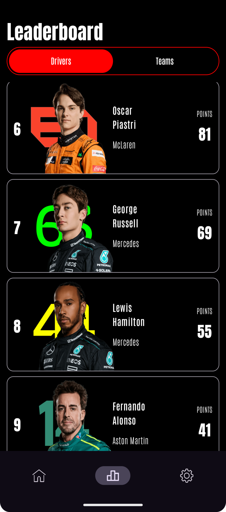
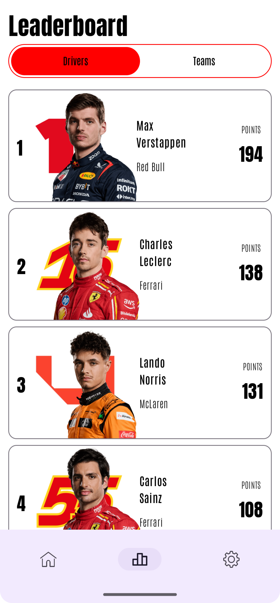
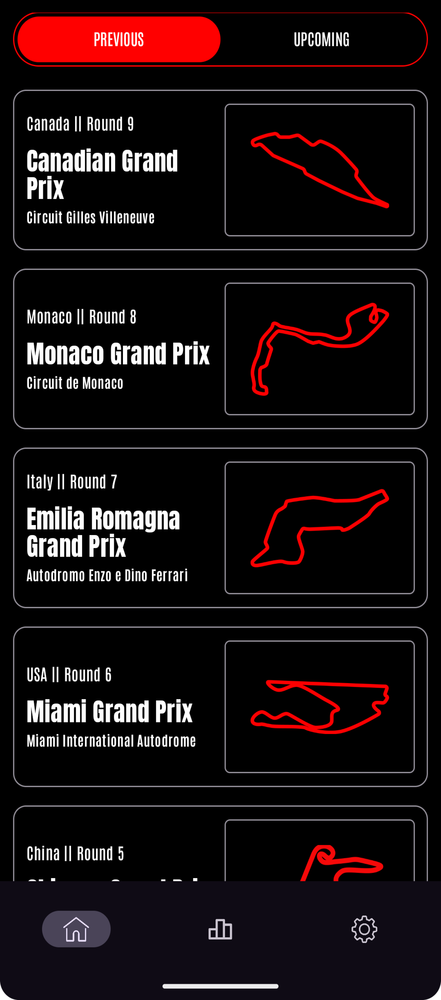
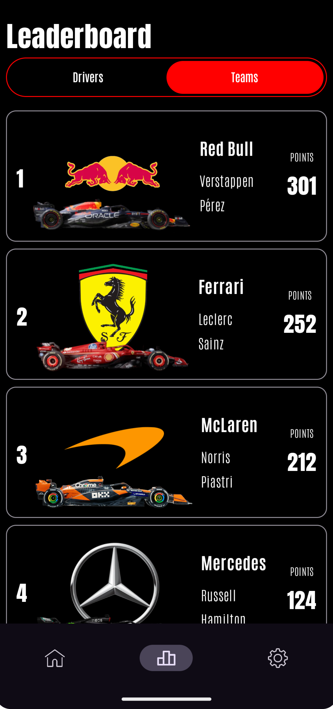
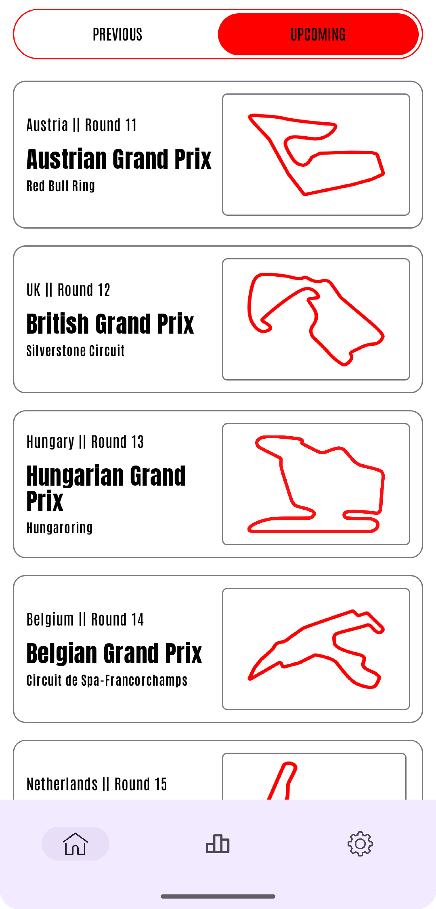

# Race-Schedule

Welcome to the Race-Schedule App! This application is designed to provide users with F1  events, viewing Drivers and Team leaderboards. Below, you'll find some screenshots and details about the technologies used in this project.

## Screenshots

### Home Screens

### Driver Leaderboards

### Previous Races

### Team Leaderboards

### Upcoming Races

## Technologies Used

- **Kotlin**: The primary programming language for this application.
- **Jetpack Compose**: For building the user interface.
- **Koin**: Dependency injection framework used for managing dependencies.
- **Ergast API**: For fetching race schedules and details.
- **Material Design**: For creating a consistent and beautiful user interface.
- **Coroutines**: For managing background tasks and asynchronous operations.
- **ViewModel**: Architecture component for managing UI-related data in a lifecycle-conscious way.

### Supposed to be an internal Release / Code will be uploaded after some period of time

